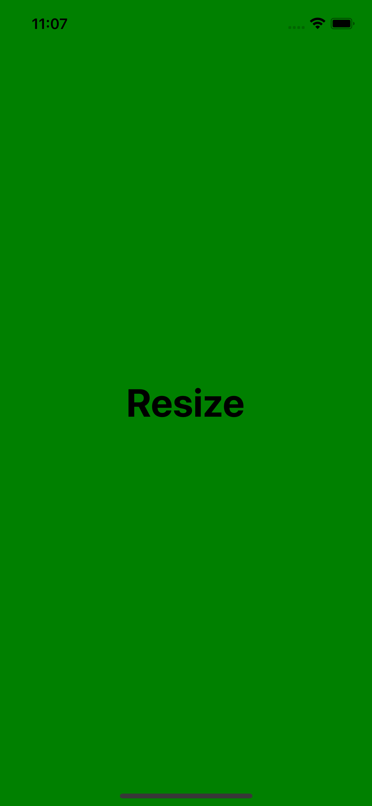
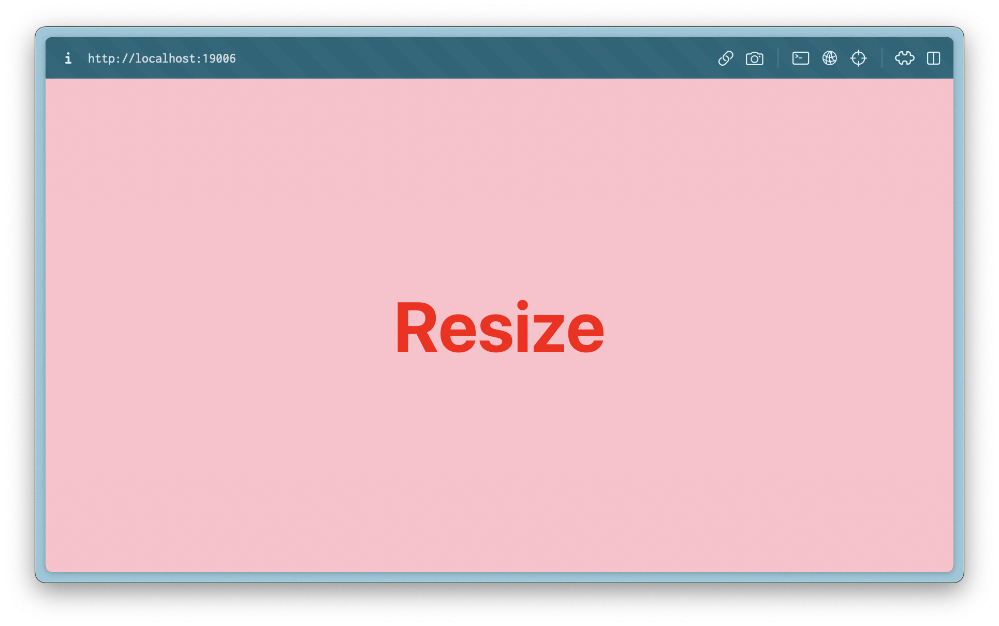

# rn-resize

The rn-resize library is a toolkit for adjusting React Native styles to fit specific devices or platforms. It offers scaling utilities, dynamic theme-based styling with a `useStyles` hook, and easy style creation.

## Supported platforms

| iOS | Android | Web |
| :-: | :-----: | :-: |
| ✅  |   ✅    | ✅  |

## Installation

```sh
yarn add -D @brantalikp/rn-resize
```

## Usage

### Creating styles with `createStyle` function

You can create your styles using the `createStyle` function. This will create a stylesheet that automatically scales numeric values based on the screen size. Non-numeric values are left as they are. You can also provide your own base `width` and `height` values for scaling.

**default Values(iPhone X):**

- _BaseWidth_ = 375;
- _BaseHeight_ = 812;

```js
import { createStyle } from '@brantalikp/rn-resize';

export const styles = createStyle(
  {
    container: {
      flex: 1,
      alignItems: 'center',
      justifyContent: 'center',
      backgroundColor: 'blue',
      width: 40, //  scales horizontally
      height: 35, //  scales vertically
    },
  },
  { baseWidth: 360, baseHeight: 640 } // optional
);
```

### Platform Specific Styles

You can define styles for a specific platform.

|                         iOS                          |                           Android                            |                         Web                          |
| :--------------------------------------------------: | :----------------------------------------------------------: | :--------------------------------------------------: |
|  |  |  |

```js
export const styles = createStyle({
  container: {
    alignItems: 'center',
    justifyContent: 'center',
    flex: 1,
    web: {
      backgroundColor: 'pink',
    },
    ios: {
      backgroundColor: 'green',
    },
    android: {
      backgroundColor: 'blue',
    },
  },
  text: {
    fontSize: 40,
    fontWeight: 'bold',
    web: {
      color: 'red',
    },
    android: {
      fontSize: 30,
      color: 'white',
    },
  },
});
```

### Creating themed styles

- If you are using a `theme` in your application, you can create styles that use the `theme` properties.

To use a theme in your application and get TypeScript type checking and autocompletion, you will first need to create your styles with the `MakeStylesProps` helper from the library.

```js
// theme.ts
import { MakeStylesProps } from '@brantalikp/rn-resize';

export const myCustomTheme = {
  colors: {
    background: 'pink',
  },
} as const;

type Theme = typeof myCustomTheme;

export type CreateStyles<T extends string> = MakeStylesProps<T, Theme>;

```

Then you need to wrap your application with the `ThemeProvider` and provide it your theme.

**Options:**

|   Option   |         value         |
| :--------: | :-------------------: |
| baseWidth  | number **(optional)** |
| baseHeight | number **(optional)** |

```js
import { ThemeProvider } from '@brantalikp/rn-resize';
import { myCustomTheme } from './theme';

function App() {
  return (
    <ThemeProvider theme={theme} options={options}>
      {/* Your application */}
    </ThemeProvider>
  );
}

export default App;
```

Then, you can create styles using your theme.

```js
import { CreateStyles } from './theme';

type StylesKeys = 'container' | 'text'; // Ensures that the useStyles hook provides autocompletion for style keys.

export const styles: CreateStyles<StylesKeys> = (theme) => ({
  container: {
    flex: 1,
    backgroundColor: theme.colors.background,
    alignItems: 'center',
    justifyContent: 'center',
  },
  text: {
    fontSize: 50,
    fontWeight: 'bold',
    color: theme.colors.text,
  },
});
```

Finally, in your components, you can use the **useStyles** hook to access the themed styles

```js
import { useStyles } from '@brantalikp/rn-resize';
import { styles } from './styles';

const MyComponent = () => {
  const { container, text } = useStyles(styles);

  return (
    <View style={container}>
      <Text style={text}>My App</Text>
    </View>
  );
};
```

### Using `useTheme` hook

If you want to access or modify the theme, you can use the `useTheme` hook.

```js
import { useTheme } from '@brantalikp/rn-resize';
import { ThemeType } from './theme'

const MyComponent = () => {
const { theme, setTheme } = useTheme<ThemeType>();

  // Access theme props
  console.log(theme.colors.background);

  // Update the theme
  const updateTheme = () => {
    setTheme({ colors: { background: 'red' } });
  };

  return (
    //
  );
}
```

## Contributing

See the [contributing guide](CONTRIBUTING.md) to learn how to contribute to the repository and the development workflow.

## License

MIT

---

Made with [create-react-native-library](https://github.com/callstack/react-native-builder-bob)
